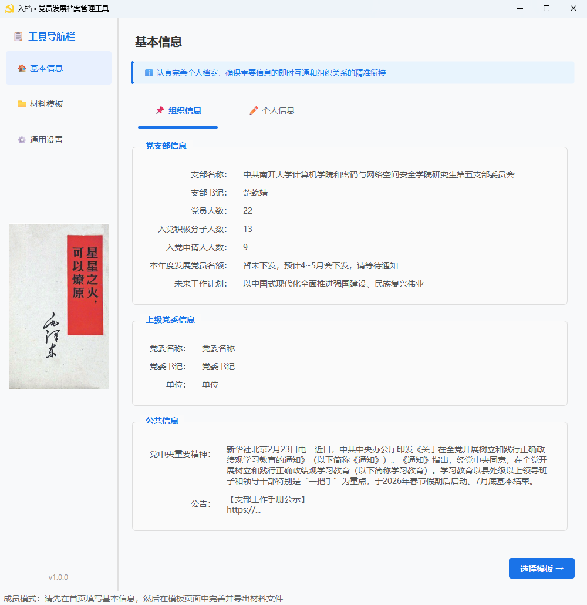
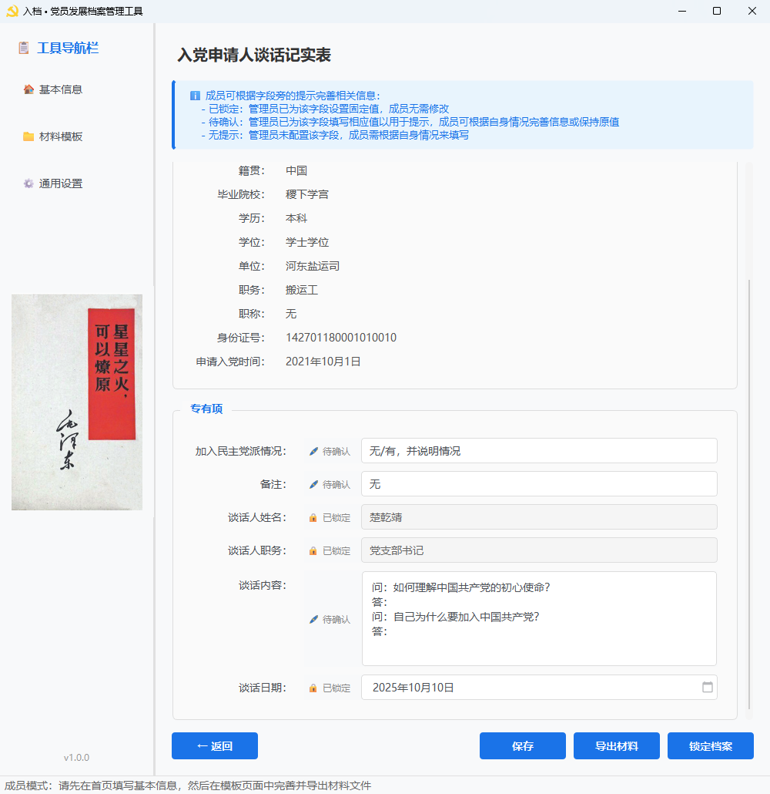
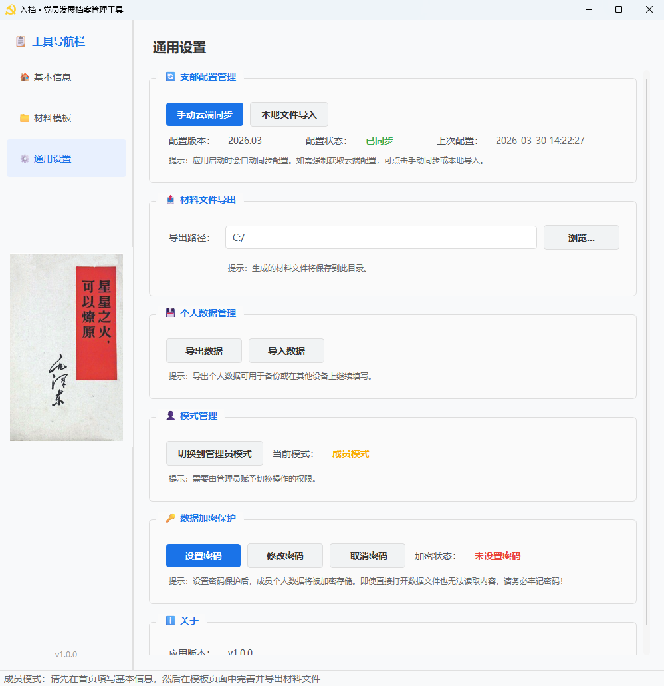

<p align="center">
  
</p>

<h1 align="center">入档</h1>

<p align="center">
  <strong>一站式自动化党员发展档案填写、生成与封存工具，告别事务繁琐，专注组织建设</strong>
</p>

<p align="center">
  <a href="#项目简介">项目简介</a> •
  <a href="#核心特性">核心特性</a> •
  <a href="#快速上手">快速上手</a> •
  <a href="#文档">文档</a> •
  <a href="#技术栈">技术栈</a> •
  <a href="#贡献指南">贡献指南</a> •
  <a href="#许可证">许可证</a>
</p>

---

## 项目简介

**「入档 • 党员发展档案管理工具」** 是一款基于 `PySide6` 开发的桌面应用程序，旨在解决党员发展过程中 **组织协调效率较低、材料信息重复录入、关键节点遗忘易错、档案备份不慎丢失** 的痛点。基于预置 `Word` 模板和智能占位符替换技术，通过党支部管理员和发展成员双端协作，各种信息仅需「录入一次」，即可应用至「同批次」发展成员的「多个」材料中。具备如下优势：

- **协作高效**：管理员维护共性配置，成员专注个性填写，联动顺畅
- **填写便捷**：同类信息一次录入、多模板复用，显著减少重复操作
- **材料准确**：字段规则校验结合占位符映射，降低漏填、错填风险
- **档案规整**：按统一模板生成文档，批次材料本地存档、结构清晰
- **隐私安全**：本地加密存储与密码保护并行，敏感信息可控可追溯

>注：凡是符合 **「共性与特性结合、跨文档数据共享」** 特征的材料汇编场景，均可使用本工具或进一步开发本程序来极大提高工作效率和信息精度。


## 界面预览

| 基本信息 | 模板详情 | 通用设置 |
|:----------:|:----------:|:--------:|
|  |  |  |

## 核心特性

- **双端协作模式**
  支持「党支部管理员」与「发展成员」两种角色。管理员配置支部信息和模板通用字段，成员专注填写个人信息，实现数据分离与协作。

- **云端配置同步**
  成员端可通过 URL 自动同步支部配置，管理员更新后无需逐一分发，只需在工具中将配置上传至网站静态资源，团队始终保持配置一致。

- **配置快照机制**
  管理员配置仅在当前时段内作用于当前发展批次的成员端，此后管理员更新配置将不再影响该批次成员端的材料专有项数据呈现，使当时数据可以持续留存。

- **模板文档填充**
  基于 `docxtpl` 实现 `Word` 模板占位符自动识别与替换，用户可根据需要自行增加或修改模板文件和字段规则，生成的文档即开即用。

- **数据安全加密**
  采用 `Argon2` 密钥派生 + `AES-GCM` 加密方案保护敏感数据，支持密码验证、加密存储、密码修改等完整安全机制。
  

## 快速上手

### 方式一：下载应用（推荐普通用户）

1. 前往 [Releases 页面](../../releases) ，根据操作系统下载最新版本
   - Windows：`入档_vX.X.X_windows.zip`
   - macOS：`入档_vX.X.X_macos.zip`
2. 解压后双击运行即可

### 方式二：从源码运行（开发者）

#### 环境要求

- **Python**: = 3.10
- **操作系统**: Windows 10/11、macOS、Linux

#### 安装步骤

1. **克隆仓库**

   ```bash
   git clone https://github.com/chuqianjing/rule-done.git
   cd rule-done
   ```

2. **配置环境**

   ```bash
   python -m venv venv

   # Windows
   venv\Scripts\activate

   # macOS / Linux
   source venv/bin/activate
   
   pip install -r requirements.txt
   ```

3. **运行程序**

   ```bash
   python main.py
   ```

首次启动时，请根据实际情况选择以「党支部管理员」或「发展成员」身份使用系统功能。

**基本工作流程：**

```
┌─────────────────┐   系统自动同步配置     ┌────────────────┐
│   管理员端       │ ──────────────────▶ │    成员端       │
│                 │                      │                 │
│ • 配置支部信息   │                      │ • 填写个人信息   │
│ • 设置模板字段   │                      │ • 完善模板文档   │
│ • 同步云端配置   │                      │ • 形成档案文件   │
└─────────────────┘                      └─────────────────┘
```

## 文档

- [用户文档](docs/user-guide.md) - 详细的功能说明、操作指南、常见问题等
- [开发者文档](docs/developer-guide.md) - 详细的代码结构、模块关系、开发流程等


## 技术栈

| 类别 | 技术 |
|------|------|
| GUI 框架 | [PySide6](https://doc.qt.io/qtforpython/) |
| 主题样式 | [PyQtDarkTheme](https://github.com/5yutan5/PyQtDarkTheme) |
| Word 处理 | [python-docx](https://python-docx.readthedocs.io/) + [docxtpl](https://docxtpl.readthedocs.io/) |
| 数据加密 | [cryptography](https://cryptography.io/) + [argon2-cffi](https://argon2-cffi.readthedocs.io/) |
| 网络请求 | [requests](https://requests.readthedocs.io/) |
| 云存储   | [Github API](https://docs.github.com/en/rest) + [阿里云OSS](https://help.aliyun.com/product/31815.html)

## 贡献指南

欢迎任何形式的贡献！

- **报告 Bug**：[提交 Issue](../../issues/new?template=bug_report.md)
- **功能建议**：[提交 Issue](../../issues/new?template=feature_request.md)
- **贡献代码**：Fork → 修改 → [提交 PR](../../pulls)

首次贡献？可以从带有 `good first issue` 标签的 Issue 开始。

详细指南请阅读 [CONTRIBUTING.md](CONTRIBUTING.md)。

## 许可证

本项目采用 [GNU General Public License v3.0 (GPL-3.0)](LICENSE) 开源许可证。

---

<p align="center">
  全世界无产者，联合起来
</p>
