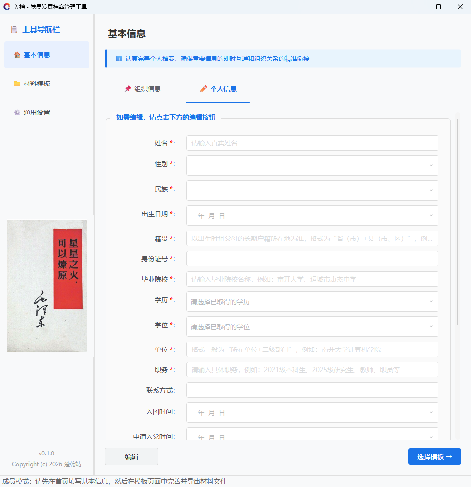
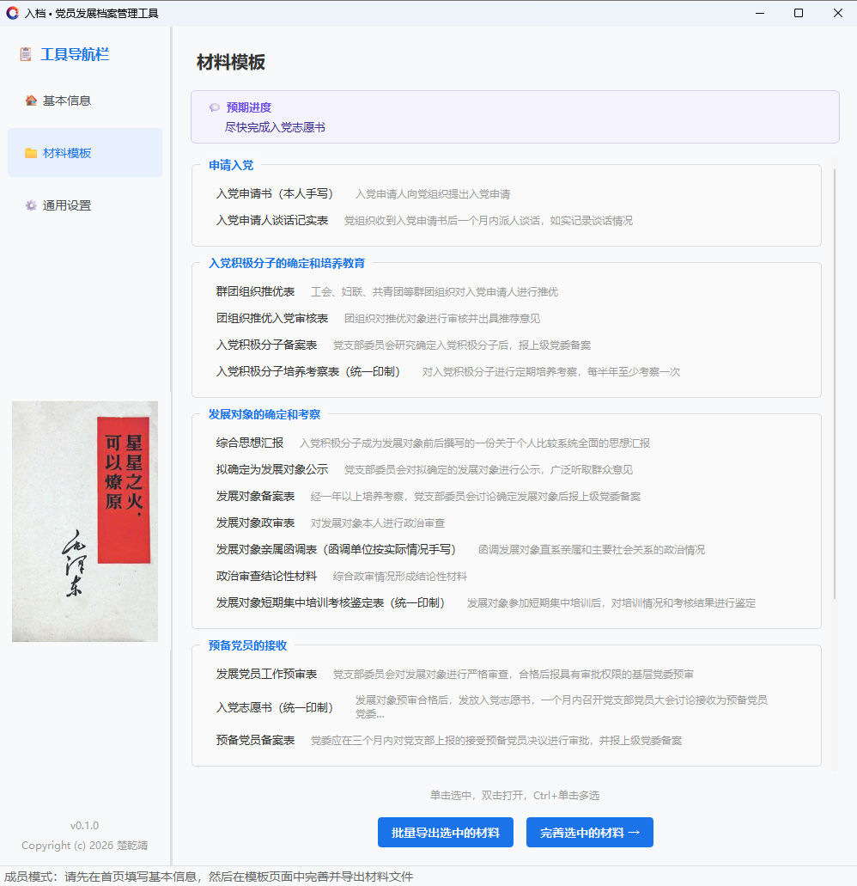
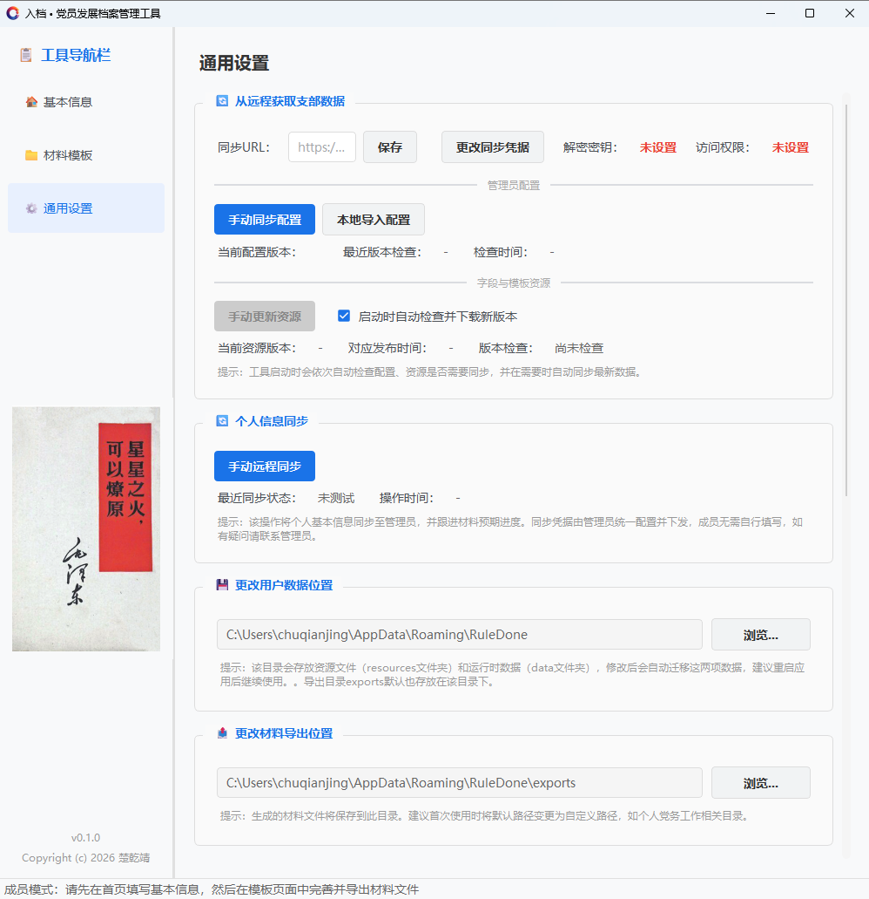

<p align="center">
  
</p>

<h1 align="center">入档</h1>

<p align="center">
  <strong>一站式自动化党员发展档案填写、生成与封存工具，告别事务繁琐，专注组织建设</strong>
</p>

<p align="center">
  <a href="#项目简介">项目简介</a> •
  <a href="#核心特性">核心特性</a> •
  <a href="#快速上手">快速上手</a> •
  <a href="#操作文档">操作文档</a> •
  <a href="#技术栈">技术栈</a> •
  <a href="#贡献指南">贡献指南</a> •
  <a href="#许可证">许可证</a>
</p>

---

## 项目简介

**「入档 • 党员发展档案管理工具」** 是一款基于 `PySide6` 开发的桌面应用程序，旨在解决党员发展过程中 **沟通协调效率较低、材料信息重复录入、关键节点遗忘易错、档案备份不慎丢失** 的痛点。基于**字段场景化映射**和**文档占位符替换**等技术，通过党支部管理员和发展成员协作，任何信息仅需「录入一次」，即可应用至「同批次」发展成员的「多个」材料中。在档案管理工作的**填材料**和**管信息**两大方面具备如下优势：

- **协作高效**：管理员维护共性配置，成员专注个性填写，所有交互一站完成
- **填写便捷**：相同信息多模板复用，可以批量导出文档，显著减少重复操作
- **材料准确**：按规则校验字段，并确保管理员配置约束，降低漏填错填风险
- **档案规整**：提供档案定制功能，支持材料全流程管理，满足各地需求差异
- **隐私安全**：成员信息本地存储，管理员配置加密传输，比传统方式更安全

>注：凡是符合 **「共性与特性结合、跨文档数据共享」** 特征的材料汇编场景，均可使用本工具或进一步开发本程序来极大提高工作效率和信息精度。


**界面预览：**

| 基本信息 | 材料模板 | 通用设置 |
|:----------:|:----------:|:--------:|
|  |  |  |

## 核心特性

- **双端协作模式**
  支持「党支部管理员」与「发展成员」两种角色。管理员配置支部信息和模板通用字段，成员专注填写个人信息，实现数据分离与协作。

- **数据远程同步**
  成员端可通过远程静态资源的 `URL` 自动同步支部配置、字段和模板资源，管理员更新后无需逐一分发，只需在工具中将相关数据同步至 `URL`。且成员基本信息亦可同步至支部成员在线汇总表并实现相关项的双端同步，支部始终保持数据一致。

- **配置快照机制**
  管理员配置仅在当前一定时段内作用于当前发展批次的成员端，此后管理员更新配置将不再影响该批次成员端已填写材料的专有项数据呈现，使当时数据可以持续留存。

- **档案定制服务**
  各支部或基层组织可根据自身实际，在工具内置示例资源的基础上，自行修改字段定义文件、编写含有占位符的模板文件和对应的模板配置文件，将资源同步至成员，成员导出的 `Word` 文档即开即用。

- **数据安全加密**
  提供企业级加密方案实现数据在远程传输和本地存储时的安全性，支持访问控制、加密传输与存储等完整安全机制。
  

## 快速上手

### 普通用户：下载应用

前往 [Releases 页面](../../releases) 下载最新版本。
  - Windows
    - 安装程序：`RuleDone-X.X.X-windows-setup.exe`
    - 便携压缩包：`RuleDone-X.X.X-windows.zip`
  - macOS
    - 安装程序：`RuleDone-X.X.X-macos-setup.dmg`
    - 便携压缩包：`RuleDone-X.X.X-macos.zip`
  
两种方式无使用差异，安装或解压后双击运行即可。若出现系统安全提示，选择仍要打开、或进行相关系统设置即可正常使用。

### 开发者：从源码运行

#### 环境要求

- **Python**: = 3.10
- **操作系统**: Windows 10/11、macOS

#### 安装步骤

1. **克隆仓库**

   ```bash
   git clone https://github.com/chuqianjing/rule-done.git
   cd rule-done
   ```

2. **配置环境**

   ```bash
   python -m venv venv

   # Windows
   venv\Scripts\activate
   # macOS
   source venv/bin/activate
   
   pip install -r requirements.txt
   ```

3. **运行程序**

   ```bash
   python main.py
   ```

### 开始使用

首次启动时，按需选择以「党支部管理员」或「发展成员」身份使用工具。基本工作流程如下：

```
┌─────────────────┐  系统自动同步支部配置  ┌────────────────┐
│   管理员端       │ ──────────────────▶ │    成员端       │
│                 │                      │                 │
│ • 配置支部信息   │                      │ • 填写个人信息   │
│ • 设置模板字段   │   系统自动同步个人信息 │ • 完善模板文档   │
│ • 同步远程配置   │ ◀────────────────── │ • 形成档案文件   │
└─────────────────┘                      └─────────────────┘
```

## 操作文档

- [用户文档](docs/user-guide.md) - 详细的功能说明、操作指南、常见问题等
- [开发者文档](docs/developer-guide.md) - 详细的代码结构、模块关系、开发流程等


## 技术栈

| 类别 | 技术 | 用途 |
|:------:|:------:|:------:|
| 开发语言 | [Python 3.10](https://www.python.org/downloads/) | 桌面应用与业务逻辑开发 |
| GUI 设计 | [PySide6](https://doc.qt.io/qtforpython/) + [PyQtDarkTheme](https://github.com/5yutan5/PyQtDarkTheme) | 界面搭建与主题美化 |
| JSON 存储 | [GitHub API](https://docs.github.com/en/rest) + [阿里云 OSS](https://help.aliyun.com/product/31815.html) | 配置文件的静态资源托管 |
| 信息汇总 | [飞书多维表格 API](https://open.feishu.cn/document/server-docs/docs/bitable-v1/notification) + [腾讯智能表格 API](https://cloud.tencent.com/document/product/1213) + [WPS多维表格 API](https://open.wps.cn/) | 成员信息在线汇总平台 |
| Word 处理 | [python-docx](https://python-docx.readthedocs.io/) + [docxtpl](https://docxtpl.readthedocs.io/) | 模板占位符替换、批量导出文档 |
| 数据加密 | [cryptography](https://cryptography.io/) + [argon2-cffi](https://argon2-cffi.readthedocs.io/) | 本地敏感数据加密存储与密码哈希 |
| 打包分发 | [PyInstaller](https://pyinstaller.org/) + [Inno Setup](https://jrsoftware.org/isinfo.php) | 应用打包与 Windows 安装程序制作 |

## 贡献指南

欢迎任何形式的贡献！

- **报告 Bug**：[提交 Issue](../../issues/new?template=bug_report.md)
- **功能建议**：[提交 Issue](../../issues/new?template=feature_request.md)
- **贡献代码**：Fork → 修改 → [提交 PR](../../pulls)

首次贡献？可以从带有 `good first issue` 标签的 Issue 开始。

详细指南请阅读 [CONTRIBUTING.md](CONTRIBUTING.md)。

## 许可证

本项目采用 [GNU General Public License v3.0 (GPL-3.0)](LICENSE) 开源许可证。

---

<p align="center">
  全世界无产者，联合起来
</p>
