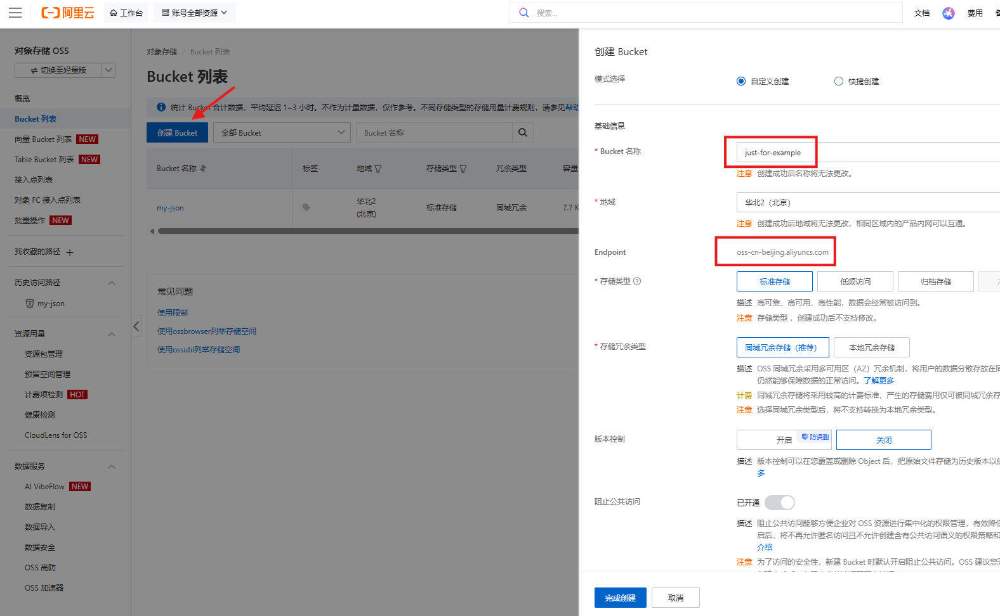
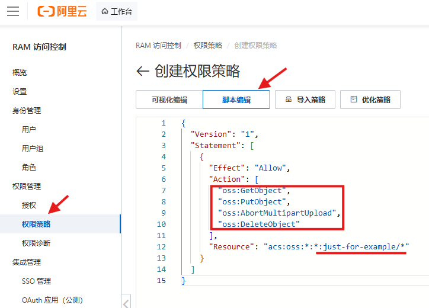
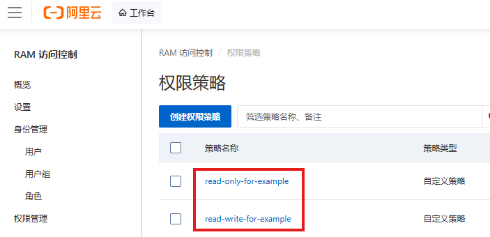
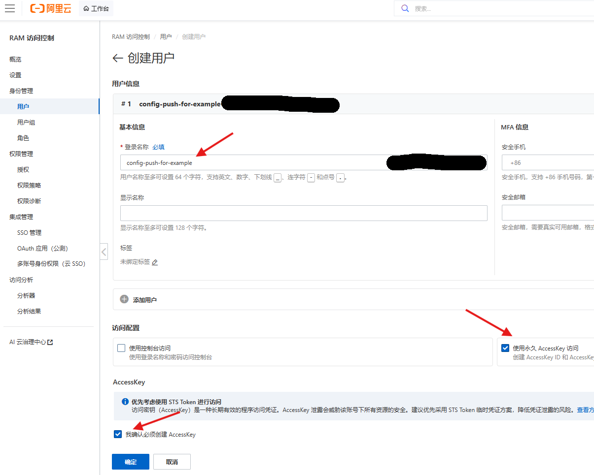
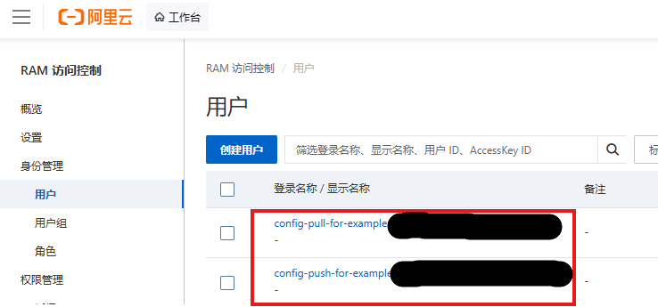
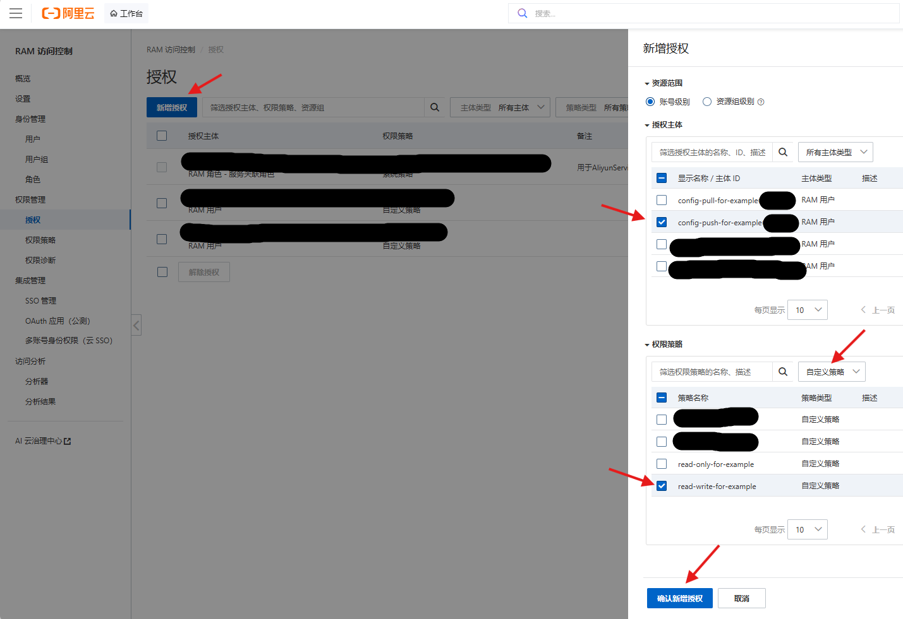
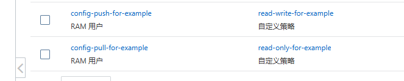
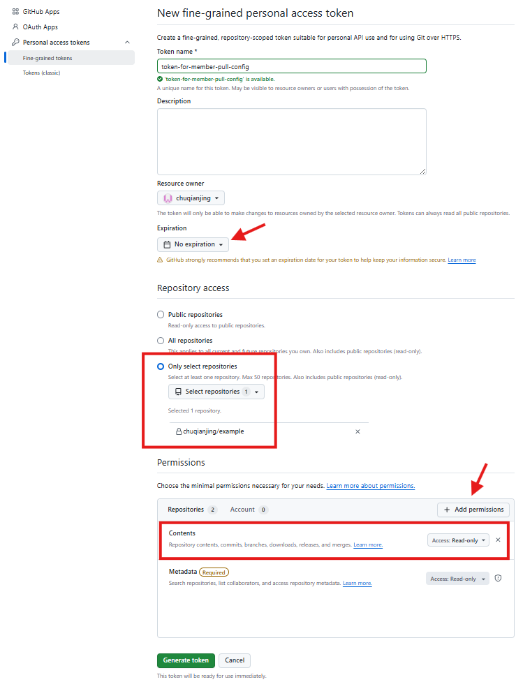

# 同步设置项说明

本文档详细介绍管理员端两项同步设置的操作方法：

- [一、设置在线表格](#一设置在线表格成员信息同步) —— 将成员基本信息汇总至在线表格，实现双端同步
- [二、设置远程仓库](#二设置远程仓库管理员配置发布) —— 将管理员配置文件发布至远程仓库，供成员端自动拉取

## 背景说明

工具借助第三方平台实现双端通信，涉及两个方向：

1. **信息汇总（成员 → 管理员）**：成员基本信息自动传输至由管理员管理的在线表格；同时管理员在表格中维护的“预期进度”等字段会回填至成员端；
2. **配置下发（管理员 → 成员）**：管理员将配置文件 `admin_config.json` 推送至远程仓库的静态资源 URL，成员端启动时自动拉取该文件。

配置同步设置项的目的是，让工具通过这些项拿到能够访问相应表格、仓库的权限，从而实现查找、编辑等操作。这些设置项需由管理员在对应官网来创建。


## 一、设置在线表格（成员信息同步）

该步骤务必遵循**最小权限原则**，即确保工具同步设置项既能够访问指定的成员信息汇总表，而不会访问到用户在平台上的其他隐私数据。

三种平台满足该原则的策略有所不同，用户自行选取：飞书多维表格的模式是“自建应用具备可写能力+表格允许该应用可编辑=该应用可编辑该表格”，以应用为基础、单次设置时步骤较多、但安全性最可控；WPS多维表格的模式是“自建应用具备可写能力+表格为该应用对应企业账号创建=该企业账号下具备可写权限的应用可编辑该表格”，以企业账号为基础、单次设置时步骤较多、安全性较可控；腾讯智能表格的模式是“账号授权开发API+表格允许该账号协作=该开发API可编辑该表格”，以账号为基础、单次设置时步骤较少、但安全性不太好控制。

### 1、飞书多维表格

注册/登录 [飞书开放平台](https://open.feishu.cn/)，创建**企业自建应用**。企业自建应用不能归属单独个人账号，没有企业账号的用户需先在飞书客户端免费创建一个团队、然后用该账号登陆开放平台，即可创建企业自建应用。创建后打开该应用设置相关项。


在「凭证与基础信息」中获取 **App ID** 与 **App Secret**。


在「权限管理」中开通多维表格相关读写权限，具体名称是“**查看、评论、编辑和管理多维表格**”。


在「版本管理与发布」中创建版本并发布，使权限和应用生效。**注意，凡是修改了该应用的任何项，都应新建版本并发布，相应修改方能生效。**


打开飞书客户端，新建一个**多维表格**作为成员信息汇总表，**将刚才新建的企业自建应用添加为表格协作者**（否则该应用无法访问该表格）。为保护数据隐私，建议在“分享”处保持该表仅协作者可访问。


复制多维表格的分享链接，在浏览器粘贴并打开，此时从浏览器显示的表格链接 `https://xxx.feishu.cn/base/{AppToken}?table={TableID}` 中获取该表格的 **App Token** 与 **Table ID**。

将以上的 **飞书AppID、飞书AppSecret、飞书AppToken、飞书TableID** 填入工具。

### 2、WPS多维表格

注册/登录 [WPS开放平台](https://open.wps.cn/)，创建**企业自建应用**。企业自建应用不能归属单独个人账号，没有企业账号的用户需要先在平台上免费创建一个团队，即可创建企业自建应用。创建后打开该应用设置相关项。


在「应用信息」中获取 **应用ID** 与 **应用密钥**；


在「权限管理」中开通多维表格相关读写权限，具体名称是“**查询和管理多维表格**”。


在「版本管理」中创建版本并申请发布，并在[企业管理后台-应用市场-应用审核](https://work.wps.cn/xz/app/audit)界面通过申请，使应用生效。**注意，凡是修改了该应用的任何项，都应新建版本、发布、通过，相应修改方能生效。**


**使用刚才创建应用的企业账号**登录WPS客户端，新建一个**多维表格**作为成员信息汇总表。点击分享，这里需要设置本企业成员可编辑，并从多维表格链接 `https://www.kdocs.cn/l/{FileID}` 中获取 **FileID**。特别注意，该企业账号下的其他在线文档如果开启了本企业成员可编辑权限，则此前创建的企业自建应用同样可以访问到这些其他文档，为避免不必要的数据泄露，建议专门创建一个企业账号用以存放该成员信息汇总表。
<div align="center">
  
</div>

**SheetID**需要运行脚本来获取。将如下代码粘贴至下图对应位置，并获取运行结果
```JavaScript
function main() {
    const sheets = Application.Sheet.GetSheets();
    console.log("=====所有数据表 SheetId清单=====");
    sheets.forEach(sheet=>{
        console.log(`表名：${sheet.name}  | SheetId：${sheet.id}`)
    })
}
main()
```


将以上的 **WPS应用ID、WPS应用密钥、WPSFileID、WPSSheetID** 全部填入工具。

### 3、腾讯智能表格

注册/登录 [腾讯文档开放平台](https://docs.qq.com/open/)，申请开发者资质。在「开发者信息」中获取 **client_id**、**access_token** 与 **open_id**。特别注意，登录平台时会有微信/QQ扫码操作，平台提供的这三条信息的权限、相当于用以扫码的用户本身，即程序用这三条信息可以访问该用户名下的所有在线文档。因此，**务必使用新注册的微信/QQ小号作为开发者的账号，该小号仅用于工具这里使用的功能，其名下不要存放个人任何文档数据。**
<div align="center">
  
</div>

打开腾讯文档客户端，新建一个**智能表格**作为成员信息汇总表，并将创建的小号用户添加为协作者。从文档分享链接 `https://docs.qq.com/smartsheet/{EncodedID}?tab={SheetID}` 中获取 **EncodedID** 和 **SheetID**。
<div align="center">
  
</div>

将以上的 **腾讯ClientID、腾讯AccessToken、腾讯OpenID、腾讯EncodedID、腾讯SheetID** 填入工具。


## 二、设置远程仓库（管理员配置发布）

该步骤也务必遵循**最小权限原则**，即确保工具同步设置项既能够访问指定的存储仓库，而不会访问到用户在平台上的其他隐私数据。同时需要保证**访问控制范围**，即确保只有支部成员才能访问到指定数据，互联网上的无关人员仅通过URL链接无法访问之。

两种平台满足如上要求的策略有所不同：二者均设置仓库为私有、从而确保访问控制权限，成员端需要通过访问凭据方能访问。**优先推荐阿里云 OSS**，其在境内网络环境下访问稳定，成员端拉取配置不受网络环境影响，且数据存储在国内、更符合组织数据的属地化与合规要求；缺点是配置步骤稍多，需要依次设置自定义权限策略、RAM子用户、用户关联权限。GitHub 设置较为简便且完全免费，但境内网络访问 `raw.githubusercontent.com` 可能不稳定，更适合网络环境可稳定访问 GitHub 的用户或仅作个人试用。

管理员端需要推送配置到仓库、成员端需要从仓库拉取配置，因此不论平台如何、**均需要针对双端设置不同的操作权限**。


### 1、阿里云 OSS

登录/注册 [阿里云](https://www.aliyun.com/)，前往 [对象存储OSS](https://oss.console.aliyun.com/overview)，新建一个 **Bucket** 作为存储仓库，新建时默认仓库私有。并记住此处的**Endpoint**和**Bucket名称**。


在 [RAM访问控制](https://ram.console.aliyun.com/overview) 中新建针对双端的不同权限策略，复制如下代码到指定区域、记得替换其中的 `your-bucket-name` 为实际值：
```javascript
// 管理员端
{
  "Version": "1",
  "Statement": [
    {
      "Effect": "Allow",
      "Action": [
        "oss:GetObject",
        "oss:PutObject",
        "oss:AbortMultipartUpload",
        "oss:DeleteObject"
      ],
      "Resource": "acs:oss:*:*:your-bucket-name/*"
    }
  ]
}

// 成员端
{
  "Version": "1",
  "Statement": [
    {
      "Effect": "Allow",
      "Action": "oss:GetObject",
      "Resource": "acs:oss:*:*:your-bucket-name/*"
    }
  ]
}
```



在 [RAM访问控制](https://ram.console.aliyun.com/overview) 中新建两个子用户并生成 **AccessKey Id** 和 **AccessKey Secret**（及时保存）。



将之前创建的两个权限，分别授予这两个用户。




在管理员端「通用设置」页相应位置填写以下参数：

| 参数 | 说明 |
| :---: | :---: |
| Endpoint | 例如 `oss-cn-hangzhou.aliyuncs.com`，按 Bucket 所在地域填写 |
| Bucket | 存储桶名称 |
| Object Key | 默认 `admin_config.json`，即对象在桶中的存放路径 |
| AccessKey Id | 管理员端 RAM 子用户的访问密钥 ID |
| AccessKey Secret | 管理员端 RAM 子用户的访问密钥 Secret |
| 资源文件路径 | 默认 `resources`，远程仓库中资源数据的存放位置 |
| 配置文件路径 | 默认 `admin_config.json`，远程仓库中配置数据的存放位置 |
| 加密密钥 | 配置文件上传至远程时要先加密 |

成员端拉取使用的 URL 为：`https://{bucket}.{endpoint}/{配置文件路径}`。请将此 URL 先填入「基本信息」页对应配置项后再进行发布配置操作。

在成员端首次打开工具时弹出的「同步凭据设置」窗口、或「通用设置」页相应板块，填入配置文件加密密钥、此前生成的成员端 RAM 子用户的 **AccessKey Id** 和 **AccessKey Secret**。


### 2、GitHub

注册/登录 [GitHub](https://github.com/)，新建一个**私有仓库**。
<div align="center">
  
</div>

在 GitHub 的 Settings → Developer settings → Personal access tokens 中生成**两个 Token**。


在token设置界面，设定仅可访问选择的仓库。通过 Add permissions → Contents，针对不同token设置不同权限：
- 用于管理员端推送配置到仓库：权限为 `Read and write`；
- 用于成员端从仓库拉取配置：权限为 `Read-only`。

创建后生成的token务必及时保存，退出页面后不会再显示token。
<div align="center" style="display: flex; justify-content: center; gap: 10px;">
  
  
</div>

在管理员端「通用设置」页相应位置填写以下参数：

| 参数 | 说明 |
| :---: | :---: |
| 仓库 | `owner/repo`，即仓库归属者/仓库名 |
| 分支 | 默认 `main`，填写目标分支 |
| Token | 此前生成的管理员端token |
| 资源文件路径 | 默认 `resources`，远程仓库中资源数据的存放位置 |
| 配置文件路径 | 默认 `admin_config.json`，远程仓库中配置数据的存放位置 |
| 加密密钥 | 配置文件上传至远程时要先加密 |

成员端拉取配置使用的 URL 为：`https://raw.githubusercontent.com/{owner}/{repo}/{branch}/{配置文件路径}`。请将此 URL 先填入「基本信息」页对应配置项后再进行发布配置操作。

在成员端首次打开工具时弹出的「同步凭据设置」窗口、或「通用设置」页相应板块，填入配置文件加密密钥和此前生成的成员端token。

