# 同步设置项说明

本文档详细介绍管理员端两项同步设置的操作方法：

- [一、设置在线表格](#一设置在线表格成员信息同步) —— 将成员基本信息汇总至在线表格，实现双端同步
- [二、设置远程仓库](#二设置远程仓库管理员配置发布) —— 将管理员配置文件发布至远程仓库，供成员端自动拉取

## 背景说明

工具借助第三方平台实现双端通信，涉及两个方向：

1. **配置下发（管理员 → 成员）**：管理员将配置文件 `admin_config.json` 推送至远程仓库的静态资源 URL，成员端启动时自动拉取该文件；
2. **信息汇总（成员 → 管理员）**：成员基本信息自动传输至管理员管理的在线表格；同时管理员在表格中维护的“预期进度”等字段会回填至成员端。

配置同步设置项的目的是，让工具通过这些项拿到能够访问相应表格、仓库的权限，从而实现查找、编辑等操作。这些设置项需要管理员在对应官网来创建。


## 一、设置在线表格（成员信息同步）

### 1、飞书多维表格

注册/登录 [飞书开放平台](https://open.feishu.cn/)，创建**企业自建应用**。企业自建应用不能归属单独个人账号，没有企业账号的用户需先在飞书客户端免费创建一个团队、然后用该账号登陆开放平台，即可创建企业自建应用。
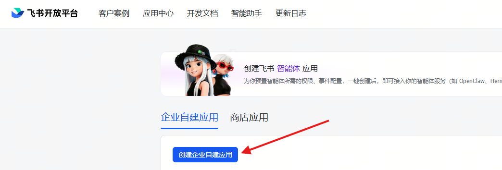

在应用「凭证与基础信息」中获取 **App ID** 与 **App Secret**。
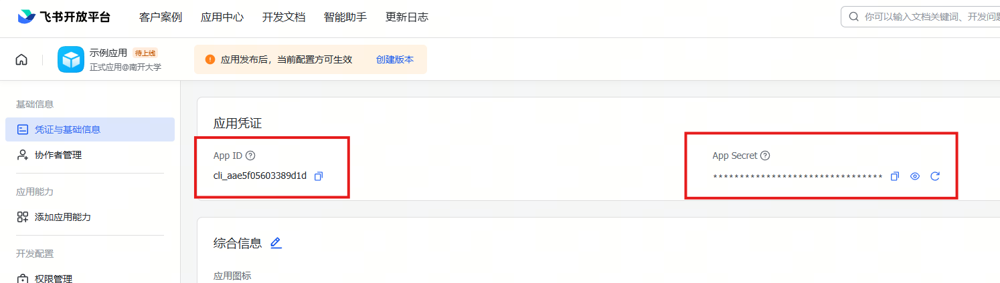

在应用「权限管理」中开通多维表格相关读写权限，具体名称是“查看、评论、编辑和管理多维表格”。
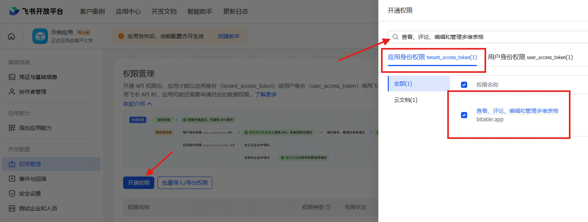

在应用「版本管理与发布」中创建版本并发布，使权限和应用生效。
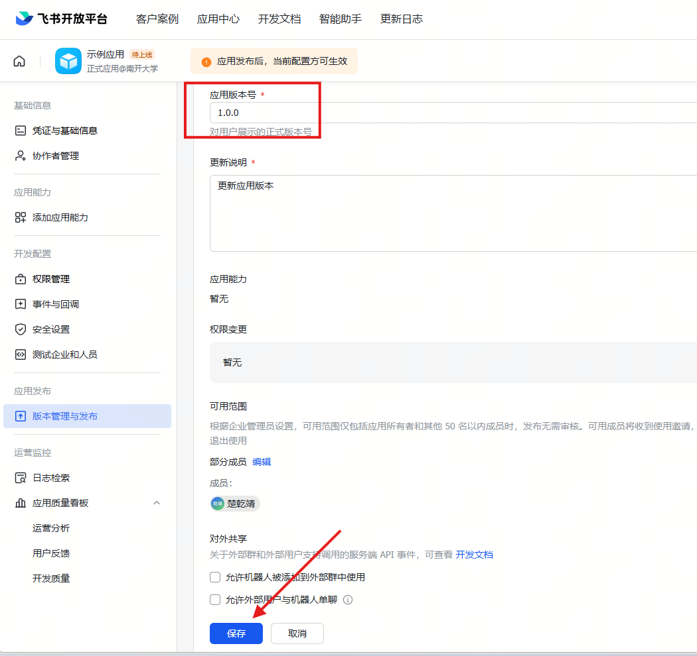

创建/打开一个**多维表格**，将该应用添加为表格协作者。为保护数据隐私，建议在“分享”处保持该表仅协作者可访问。
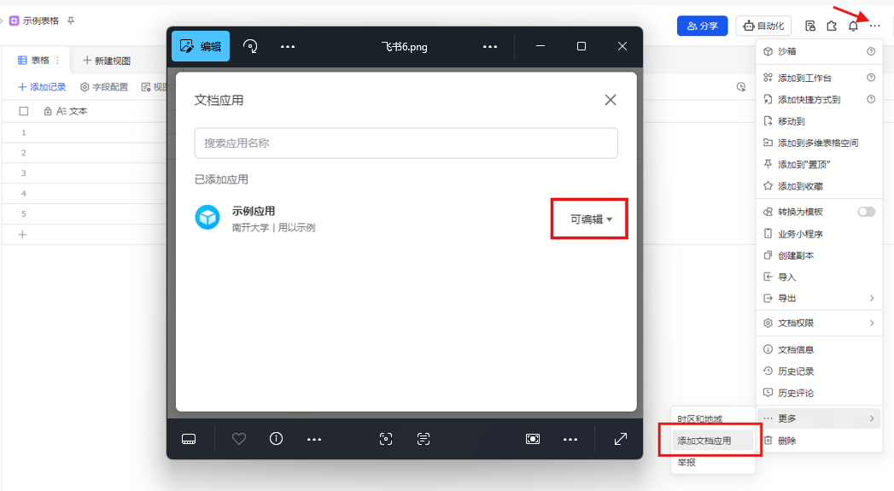

将多维表格的分享链接复制并通过浏览器打开，此时从浏览器显示的表格链接 `https://xxx.feishu.cn/base/{AppToken}?table={TableID}` 中获取该表格的 **App Token** 与 **Table ID**。

将以上的 **飞书AppID、飞书AppSecret、飞书AppToken、飞书TableID** 填入工具。

### 2、腾讯智能表格

注册/登录 [腾讯文档开放平台](https://docs.qq.com/open/)，申请开发者资质。在「开发者信息」中获取 **Client ID（应用ID）**、**Access Token** 与 **Open ID**。
<div align="center">
  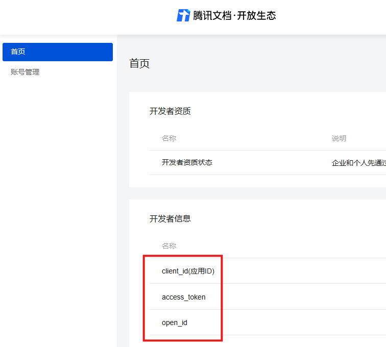
</div>

创建/打开一个**智能表格**，从文档分享链接 `https://docs.qq.com/smartsheet/{Encoded ID}?tab={Sheet ID}` 中获取 **Encoded ID** 和 **Sheet ID**。为保护数据隐私，建议在“分享”处保持该表仅自己可访问。
<div align="center">
  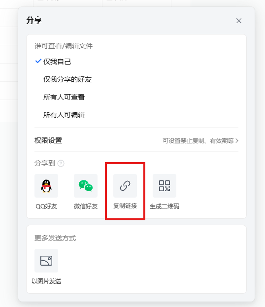
</div>

将以上的 **腾讯ClientID、腾讯AccessToken、腾讯OpenID、腾讯EncodedID、腾讯SheetID** 填入工具。

### 3、WPS多维表格

注册/登录 [WPS开放平台](https://open.wps.cn/)，创建企业自建应用。企业自建应用不能归属单独个人账号，没有企业账号的用户需要先创建一个团队、然后用该账号登陆开放平台，即可创建企业自建应用。
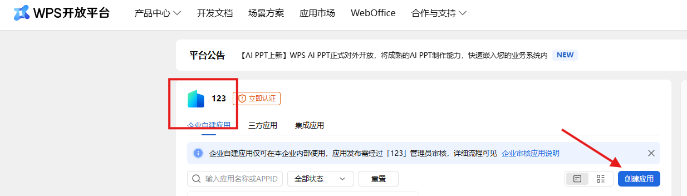

在应用「应用信息」中获取 **应用ID** 与 **应用密钥**；
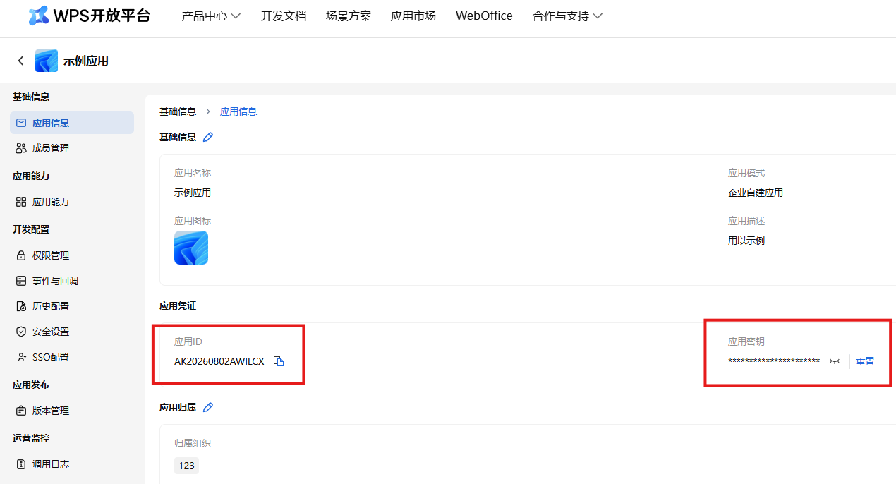

在应用「权限管理」中开通多维表格相关读写权限，具体名称是“查询和管理多维表格”。
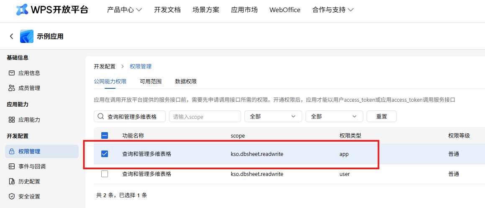

在应用「版本管理」中创建版本并申请发布，并在[企业管理后台-应用市场-应用审核](https://work.wps.cn/xz/app/audit)界面通过申请，使应用生效。
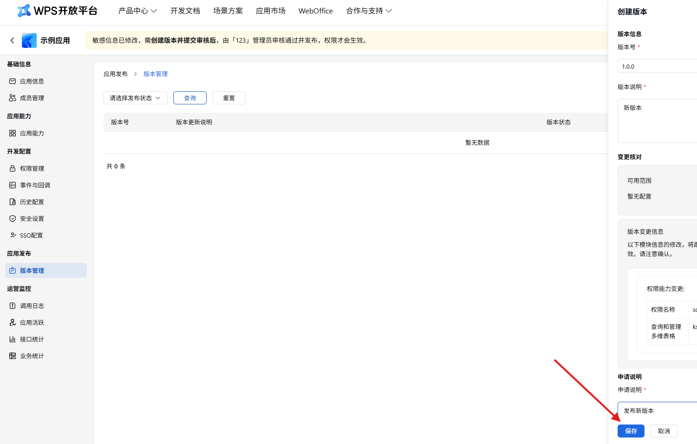

在 WPS 中创建/打开一个**多维表格**，从多维表格链接 `https://www.kdocs.cn/l/{FileID}` 中获取 **FileID**。
<div align="center">
  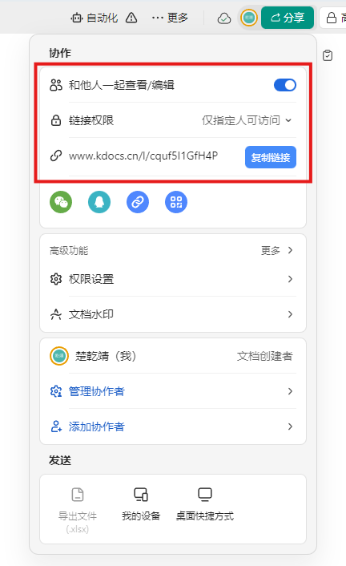
</div>


SheetID需要运行脚本来获取。将如下代码粘贴至下图对应位置，并获取运行结果
```JavaScript
function main() {
    const sheets = Application.Sheet.GetSheets();
    console.log("=====所有数据表 SheetId清单=====");
    sheets.forEach(sheet=>{
        console.log(`表名：${sheet.name}  | SheetId：${sheet.id}`)
    })
}
main()
```
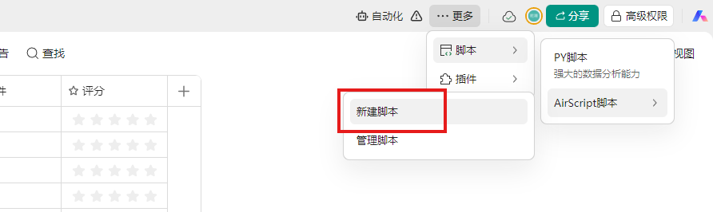
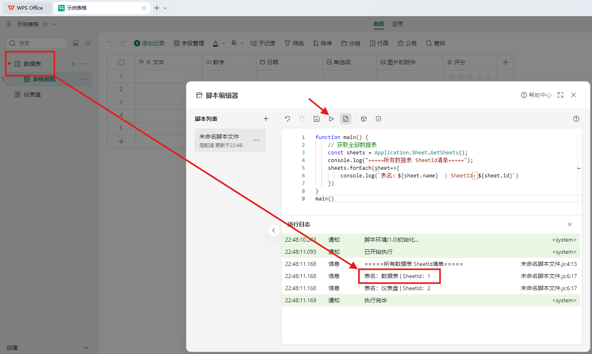

将以上的 **WPSAppID、WPSAppSecret、WPSAppToken** 填入工具；**WPSTableID** 可留空，留空时工具将自动使用文档中的第一个数据表。


## 二、设置远程仓库（管理员配置发布）


### 1、GitHub

注册/登录 [GitHub](https://github.com/)，新建一个**公开仓库**。
<div align="center">
  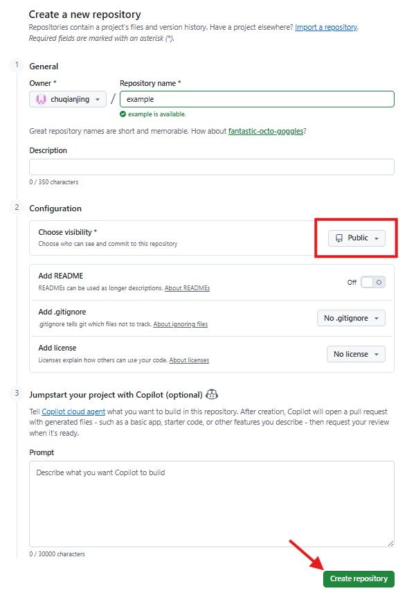
</div>

在 GitHub 的 Settings → Developer settings → Personal access tokens 中生成一个 Token。
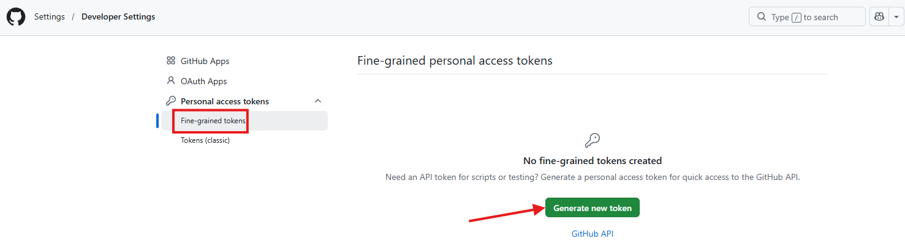

在token设置界面，设定仅可访问选择的仓库。勾选仓库内容写入权限（`repo` 或 `contents:write` 权限，公开仓与私有仓写入都需要）.
<div align="center">
  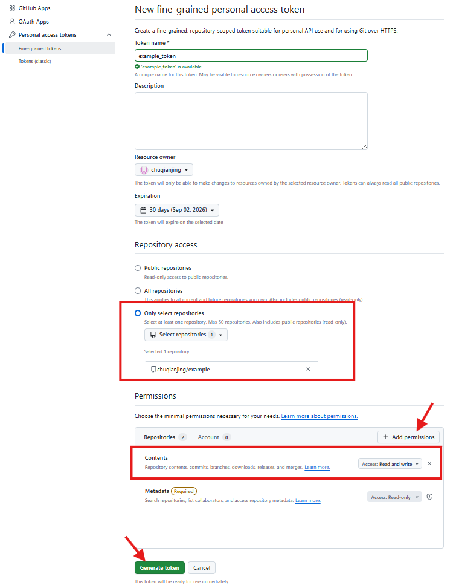
</div>

在工具的「通用设置」页相应位置填写以下参数：

| 参数 | 说明 |
| --- | --- |
| 仓库 | `owner/repo`，即仓库归属者/仓库名 |
| 分支 | 默认 `main`，填写目标分支 |
| 文件路径 | 默认 `admin_config.json`，即远程仓库中的存放路径 |
| Token | 上一步生成的个人访问令牌 |

成员端拉取使用的 URL 为：`https://raw.githubusercontent.com/{owner}/{repo}/{branch}/{文件路径}`。

### 2、阿里云 OSS

登录/注册 [阿里云](https://www.aliyun.com/)，前往 [对象存储OSS](https://oss.console.aliyun.com/overview)，新建一个 **Bucket**（上传时工具会自动将文件 ACL 设为 `public-read`，请确认 Bucket 支持公开读）；

在 RAM 访问控制中为管理员创建一个子用户并生成 **AccessKeyId / AccessKeySecret**，授予该 Bucket 的对象读写权限（如 `PutObject`）；

在工具中填写以下参数：

| 参数 | 说明 |
| --- | --- |
| Endpoint | 例如 `oss-cn-hangzhou.aliyuncs.com`，按 Bucket 所在地域填写 |
| Bucket | 存储桶名称 |
| Object Key | 默认 `admin_config.json`，即对象在桶中的存放路径 |
| AccessKeyId | RAM 子用户的访问密钥 ID |
| AccessKeySecret | RAM 子用户的访问密钥 Secret |

成员端拉取使用的 URL 为：`https://{bucket}.{endpoint}/{object_key}`。

### 3、设置加密密钥

在「传输至远程时的加密密钥」输入框中填写密钥（留空则推送不加密的配置）。

- 设置后，工具会在上传前对整个配置文件进行加密（PBKDF2 + Fernet）；
- 请务必通过**线下渠道**（群聊、当面等）将解密密钥告知成员；
- 成员端首次使用或更换密钥时，在「系统设置」页点击「更改配置解密密钥」输入该密钥，方能解密拉取到的配置。

### 4、发布配置

完成以上配置后，在「本地配置文件同步至远程」分组中依次：

1. 点击「**测试远程连接**」，确认能正常访问目标仓库/存储桶；
2. 点击「**保存同步设置**」，保存以上同步参数（Token、密钥等敏感信息会加密存储）；
3. 确认「基本信息」页「双端交互」分组的「配置文件的URL」已填写正确；
4. 点击「**立即同步到远程**」，确认后即将当前管理员配置发布到远程；页面下方会显示最近同步状态、时间与目标。

> 注：此后若修改了支部配置，重新点击「立即同步到远程」即可再次发布，成员端会自动获取到最新配置。

