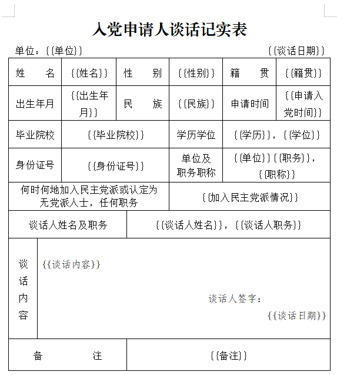

# 用户文档

本文档帮助你使用 **「入档 • 党员发展档案管理工具」** 的各项功能。

## 目录

- [快速入门](#快速入门5分钟上手)
- [党支部管理员操作指南](#党支部管理员操作指南)
- [发展成员操作指南](#发展成员操作指南)
- [高级功能](#高级功能)
- [常见问题](#常见问题-faq)

---

## 快速入门（5分钟上手）

### 1、安装应用

前往 [Releases 页面](../../releases) 按需下载最新版本。

### 2、首次启动时选择身份

- 「党支部管理员」：配置支部信息、模板通用字段，管理成员汇总数据
- 「发展成员」：填写个人信息、生成材料，维护个人档案数据

### 3、基本工作流程（党员档案归档流程）

- **填写并发布配置**：管理员在工具上配置当前批次发展成员待归档材料的信息，并将其上传至远程存储仓库；
- **双方交流**：管理员通过群聊等方式通知当前批次成员完善待归档材料，说明纸质版材料提交截止日期及若干注意事项；
- **获取并完善材料**：成员在工具上自动获取到支部最新配置，然后完善待归档材料，导出文档、微调格式、打印为纸质版；
- **归档存档**：成员将材料交至管理员处，检查无误后归档，同时在工具中锁定材料并留存相关流程图片。


## 党支部管理员操作指南

### 1、制定资源

这里的资源特指支部自身场景需要的字段定义、实际的材料模板和其配置说明。由于各地、各基层使用的资源不尽相同，所以工具并未提供可直接使用的模板。各支部需要结合自身实际，在工具内置示例资源的基础上，在管理员端「通用设置」页的「管理字段和模板资源」分组，打开资源文件夹，按如下步骤进行资源的定制化修改、编写，并将其同步给成员使用。

>注：地方特定等级党委下属的各支部通常会使用相同资源，建议同属各支部针对该等级统一制定资源，减少重复工作。

#### 完善字段定义

`fields_definition.json` 是字段规则文件，位于资源文件夹的 `schema/` 目录下，用于定义工具中呈现的各类字段，共分三类：
- `admin_fields`：管理员字段，按 `group` 分组（如“党支部信息”“公共信息”），在管理员端「基本信息」页按组填写；
- `member_fields`：成员个人字段（如“姓名”“身份证号”），在成员端「基本信息」页填写；
- `template_fields`：模板专有项，工具会按 `match_keywords` 匹配 `{{占位符}}`，在「模板详情」页呈现对应填写控件。

各字段常用属性：`key` 为字段名，`type` 为类型（`text`、`number`、`textarea`、`select`、`date` 等），`required` 表示是否必填，`display.order` 控制呈现顺序、`display.placeholder` 为占位提示。管理员可根据实际业务需求，添加分组、修改字段定义。

#### 标记模板材料

汇总发展流程全部材料为 `.docx` 格式的文档，将它们放置在资源文件夹的 `templates/` 目录下。在使用前，需要对每个文件使用形如 `{{待填项名称}}` 的占位符在待填项处进行标记。请务必注意以下标记规则：
  - 工具的「模板详情」页展示的项名即为 `{{...}}` 中的“待填项名称”；
  - 必要时，请使用短下划线“_”来分隔“待填项名称”的语义，例如“党支部意见_内容”；
  - “待填项名称”中包含特定字符时，界面对该项的呈现样式由此前定义的 `fields_definition.json` 中的相关字段决定。内置资源中的模板字段格式如下：
    ```bash
     "要求"、"填写要求"：15行左右的文本类型
     "内容"、"填写内容"：3行左右的文本类型
     "简历"、"优缺点"：5行左右的文本类型
     "日期"、"填写日期"、"时间"、"填写时间"：日期类型
     "人数"、"数量"、"数目"、"票数"：数字类型
     不包含上述字符的项：1行短文本类型
    ```
<div align="center">
  
</div>

>注：有些统一印制、需要手写的文件并不需要本工具来导出为填好的材料，但也建议管理员新建其对应的 `.docx` 文档，并在其中标记所有的待填项、以便成员直接参照来手写材料，或者也可以仅填入类似“要求”的占位符。

#### 编写配置文件

`templates_config.json` 是关于模板的配置说明文件，位于资源文件夹的 `templates/` 目录下，管理员可在此示例基础上修改。该文件用以在工具界面中标记所有模板文件的阶段、用途等信息。建议支部根据本地工作实际，认真编写该文件，增强成员对党员发展工作的严肃认识和组织意识。该文件中各字段含义说明如下：
```json
{
  "stages": [
    {
      "name": "申请入党",     // 阶段名称，「模板列表」页会分组呈现各阶段材料
      "order": 1,            // 该阶段在「模板列表」页的呈现顺序
      "description": "申请阶段，提交入党申请书，党支部进行谈话"   // 该阶段的描述
    },
    ......
  ],
  "templates": [
    {
      "file": "入党申请书.docx",         // 模板文档的文件名
      "name": "入党申请书（本人手写）",   // 该模板在工具中的呈现名称
      "stage": "申请入党",               // 该模板所属阶段，需要与“阶段名称”完全一致
      "order": 1,                       // 该模板在「模板列表」页的呈现顺序
      "description": "入党申请人向党组织提出入党申请"   // 模板描述会呈现在模板名之后
    },
    ......
  ]
}
```

#### 发布资源

在「通用设置」页的「发布支部数据至远程」分组，点击「发布资源」将其上传至远程，资源对应的URL会自动回填至首页对应配置项中。其中的同步设置项操作请见下文 [发布配置](#3发布配置)。


### 2、填写配置

#### 填写支部基本信息

进入「基本信息」页，根据页面内容和实际情况填写并保存。

>注：为便于管理员将更多发展党员工作的重要信息统一汇总，本工具在当前页面设置了多种板块，管理员可按需使用。建议将支部重要文件、发展党员相关规定等的链接填写在相应栏目。

#### 配置模板通用字段

进入「模板列表」页，点击需要配置的模板，进入「模板详情」页配置当前发展批次成员在该模板的通用字段。本工具为模板字段的配置提供了如下三种方式，管理员可按需使用：
- 锁定：勾选锁定框，管理员设定的该字段值在成员端会固定显示（不论该字段是否为空值），成员无法修改
- 提示：管理员为该字段填写相应的值，但不勾选锁定框，该字段值在成员端会以提示的方式呈现，成员可根据需要修改其值
- 无：管理员不配置该字段（既不填写值、也不勾选锁定框），该字段在成员端无任何配置信息，成员根据个人情况来填写

>注：为更好提升工作效率，针对同批次成员的当前阶段各项流程，建议管理员统筹安排、积极联系上下级组织，使每项程序仅进行一次，从而使特定模板通用字段可更多地适用于当前批次成员。

### 3、发布配置

由于资金有限，工具目前是借助第三方平台来实现双端通信的。一方面，管理员将配置文件 `admin_config.json` 和资源等推送至远程仓库、成员端自动拉取相关数据到本地；另一方面，成员基本信息可以自动传输到管理员管理的在线表格。这两方面均须管理员设置相关同步项，这些同步项也会保存在配置文件中以供成员端使用。

>注：设置同步项略微麻烦，但好在只需最初设置一次，后续沿用即可。当然，建议属于同一基层党委的各支部尽可能共享若干同步设置项，减少不必要重复工作。例如，可在同一仓库中存放不同支部的文件。

#### 设置在线表格

工具为管理员提供了汇总成员基本信息到在线表格的功能，用户可根据偏好选择表格平台。在线表格有如下要求或要点：
- 格式：务必使用飞书多维表格、腾讯智能表格、WPS多维表格这类数据存储表格，不要使用在线Excel表；请将这类在线表格理解为数据存储平台，灵活使用这类表格的视图功能、呈现不同的业务数据
- 字段：表格字段列名需要与成员端「基本信息」页「个人信息」版面列出的字段名称完全一致、并设置为文本类型，如此方能将成员端信息同步到对应列中；成员的该字段信息在表中一经确定，则不支持其在成员端修改
- 特殊字段：需在表中添加“进度提醒”字段，该信息会呈现在成员端「模板列表」页
- 其他字段：除上述字段外，可在数据表中添加其他任意字段，且不会对成员端有任何影响

在线表格同步设置项的获取方式和具体配置，详见 [同步设置项说明](sync_guide.md#一设置在线表格成员信息同步)。

#### 设置远程仓库

本工具提供了阿里云OSS和GitHub两种云存储方式，均可实现配置文件的访问控制和加密保护。**优先推荐阿里云 OSS**，其境内网络访问稳定、数据存储在国内，更符合组织数据的合规要求；GitHub 设置更简便，但境内访问 `raw.githubusercontent.com` 可能不稳定。在「通用设置」页的「本地配置文件同步至远程」分组，选择同步目标并配置相关参数，点击「立即同步到远程」即可保存相关参数并发布配置到远程存储仓库。

远程仓库同步设置项的获取方式和具体配置，详见 [同步设置项说明](sync_guide.md#二设置远程仓库管理员配置发布)。

### 4、维护配置

#### 锁定配置

设定好当前阶段的相关配置后，可在「系统设置」页的「锁定管理」分组锁定所有配置，避免误触修改。锁定后如需修改，亦可解锁配置。

#### 导入导出

若因网络问题无法通过云存储进行双端配置通信，管理员可在「系统设置」页的「导入导出」分组将配置文件导出并直接分发给成员。管理员亦可用导出的配置在其他设备上导入后继续操作。

#### 设置密码

若需避免他人查看或更改信息，可在「系统设置」页的「密码管理」分组设置密码，设置后管理员端每次启动应用时需要输入密码验证。

#### 效果检查

如需查看配置在成员端的呈现效果，管理员可在「系统设置」页的「模式管理」分组切换到成员模式来查看。请确保在切换前，将「基本信息」页的「成员可否切换模式」设为“允许”，以免无法切回。


## 发展成员操作指南

### 1、获取配置

首次使用时，需要获取所在支部的管理员配置文件 `admin_config.json`，且默认需要为该文件的远程获取设置同步凭据。

成员须向支部管理员获取配置同步 URL，启动应用时选择「通过 URL 同步配置」，输入 URL 完成同步。必要时也可使用「从本地导入配置文件」方式来同步。

### 2、完善材料

#### 填写基本信息

「基本信息」页提供了「组织信息」和「个人信息」两个分组，成员可在前者中了解支部若干重要信息，可在后者中编辑并保存个人信息。

启动工具时会从管理员的在线表格中自动双端同步基本信息中的若干非必填字段，有的信息无需成员专门填写、例如当前批次成员的某个基本时间节点。

#### 填写模板字段

当需要填写某份材料时，在「模板列表」页找到目标模板，在「模板详情」页填写并保存该模板的专有字段。管理员会根据需要设定若干字段的值，成员可根据字段旁的信息来填写：
- 已锁定：管理员已为该字段设置固定值，成员无需修改
- 待确认：管理员已为该字段填写相应值以用于提示，成员可根据自身情况完善信息或保持原值
- 无提示：管理员未配置该字段，成员需根据自身情况来填写

特别说明，为确保信息填写准确无误，成员端出现如下情况时无法填写目标模板（进入「模板详情」页时弹出提醒、并退到相关操作页），并给出对应解决办法：
- 打开工具时，未成功自动同步支部配置；在回退到的「系统设置」页中手动同步
- 打开工具时，未成功自动同步个人信息；在回退到的「系统设置」页中手动同步
- 当前模板的基本项中存在空值；在回退到的「基本信息」页中完善个人信息

#### 导出文档

- 单个导出：在「模板详情」页点击「导出」按钮，系统自动生成填充好信息的 `Word` 文档。如有需要，可在「系统设置」页中修改导出文件的保存位置。

- 批量导出：在「模板列表」页可批量导出相应文档。

>注：工具无法控制导出的文档内容中的字符格式，如果格式不满足特定要求（通常是表格需控制在1页），打开文档手动微调即可。

### 3、维护档案

#### 本地存档

当某份材料填写完成并上交，且不需要再修改时，可以通过锁定操作来固定留存该材料文件的信息。在「模板详情」页点击「锁定材料」按钮，锁定后该材料将变为只读状态。锁定材料后，成员可通过「存档管理」留存相关图片，并可以删除或查看。

> [!IMPORTANT]
> - **及时锁定**：配置快照机制仅作用于专有项，管理员关于基本信息的未来配置仍会影响成员端对应数据呈现（虽然这些项在一张表中的数量通常很少），故强烈建议成员在每份材料归档后即锁定材料。锁定操作不可撤销，请确保材料填写无误后再锁定
> - **遵规守纪**：根据相关法规，个人严禁擅自拍照留存党员档案，成员可留存本人会议照片、允许的资料等。

#### 数据迁移

成员如需在其他设备上操作，可提前在「系统设置」页的「个人数据管理」分组中将个人数据文件 `member_info.json` 导出并发送至目标设备，在该设备上导入个人数据即可。

#### 密码保护

进入「系统设置」页，在相应分组中设置密码保护个人档案数据，下次启动时需要输入密码。


## 高级功能

若用户的业务需求逻辑与本工具的完全一致，则可按如下步骤直接使用工具：

### 1、定义字段

分析任务场景，确定个体基本项、整体基本项、模板常见项，并制定每项的规则，编写字段规则文件 `fields_definition.json`。以就业类的表格材料为例，可能的字段规则定义如下：

```json
{
  "admin_fields": [
    {
      "group": "部门",
      "group_order": 1,
      "fields": [
        {"key": "部门名称", "type": "text", "required": true, "display": {"order": 1}},
        ......
      ]
    },
    ......
  ],
  "member_fields": [
    {
      "key": "行业", "type": "select", "required": true, "options": ["农业", "工业", "其他"], "display": {"label": "行业", "order": 2}
    },
    ......
  ],
  "template_fields": [
    {
      "key": "内容", "type": "textarea", "required": false, "match_keywords": ["内容"], "display": {"placeholder": "请输入内容", "rows": 5}
    },
    ......
  ]
}
```

### 2、准备模板和配置说明
按照[党支部管理员操作指南中的相关步骤](#1制定资源)继续制定相关资源。


### 3、在工具中使用

重启工具即可应用至目标业务场景。


## 常见问题 (FAQ)

若文档未解决您的相关问题，欢迎在 GitHub 提交 [Issue](../../issues)

