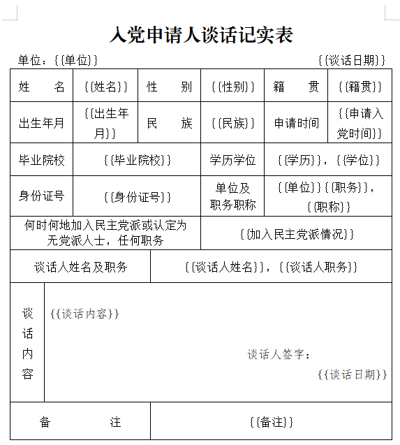
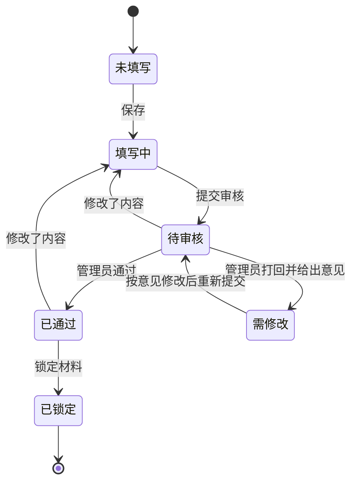

# 用户文档

本文档帮助你使用 **「入档 • 党员发展档案管理工具」** 的各项功能。

## 目录

- [快速入门](#快速入门5分钟上手)
- [党支部管理员操作指南](#党支部管理员操作指南)
- [发展成员操作指南](#发展成员操作指南)
- [高级功能](#高级功能)
- [常见问题](#常见问题-faq)

---

## 快速入门（5分钟上手）

### 1、安装应用

前往 [Releases 页面](../../releases) 按需下载最新版本，两种方式任选：

- **安装版**：下载 `RuleDone-<版本>-windows-setup.exe`（Windows）或 `RuleDone-<版本>-macos-setup.dmg`（macOS），按向导安装。程序会装到系统默认位置，并创建快捷方式。
- **绿色版**：下载对应的 `.zip` 解压后直接运行，不写入注册表，适合放在 U 盘或任意目录。

两种方式的用户数据都存放在独立目录（Windows 为 `%APPDATA%\RuleDone`，macOS/Linux 为 `~/.ruledone`），与程序文件分离，因此升级或更换安装方式都不会丢失已有档案。

### 2、更新应用

程序启动时会自动检查新版本，也可以在「设置」页手动点击「检查更新」。发现新版本后点击「立即更新」即可，程序会按当前的安装方式自动完成升级：

- **安装版**：下载安装包后静默升级，安装位置与原先一致，完成后自动重新启动（过程中可能出现一次系统权限确认）。
- **绿色版**：下载后原地替换程序目录，替换失败会自动回滚到旧版本。
- **macOS**：下载后自动打开安装包（或定位到文件管理器），拖拽替换即可。

下载过程中可以取消，中断后重试会从断点继续，下载完成会先校验文件完整性。若暂时不想升级可点击「稍后」；在启动提示中勾选「不再提醒此版本」后，该版本不再弹出提示。升级全程不触碰用户数据目录。

### 3、首次启动时选择身份

- 「党支部管理员」：配置支部信息、模板通用字段，管理成员汇总数据
- 「发展成员」：填写个人信息、生成材料，维护个人档案数据

### 4、基本工作流程（党员档案归档流程）

- **填写并发布配置**：管理员在工具上配置当前批次发展成员待归档材料的信息，并将其上传至远程存储仓库；
- **双方交流**：管理员通过群聊等方式通知当前批次成员完善待归档材料，说明纸质版材料提交截止日期及若干注意事项；
- **获取并完善材料**：成员在工具上自动获取到支部最新配置，然后完善待归档材料；
- **提交审核（可选）**：若管理员为某份材料开启了「材料审核机制」，成员需在导出前将该材料中由自己填写的条目**提交审核**，由管理员审核并给出「已通过 / 需修改」意见，审核通过后方可导出；
- **导出打印**：导出文档、微调格式、打印为纸质版；
- **归档存档**：成员将材料交至管理员处，检查无误后归档，同时在工具中锁定材料并留存相关流程图片。


## 党支部管理员操作指南

### 1、制定资源

这里的资源特指支部自身场景需要的字段定义、实际的材料模板和其配置说明。由于各地、各基层使用的资源不尽相同，所以工具并未提供可直接使用的模板。各支部需要结合自身实际，在工具内置示例资源的基础上，在管理员端「通用设置」页的「管理字段和模板资源」分组，打开资源文件夹，按如下步骤进行资源的定制化修改、编写，并将其同步给成员使用。

>注：地方特定等级党委下属的各支部通常会使用相同资源，建议同属各支部针对该等级统一制定资源，减少重复工作。

#### 完善字段定义

`fields_definition.json` 是字段规则文件，工具已经内置了一个示例、位于资源文件夹的 `schema/` 目录下，用于定义工具中呈现的各类字段，共分三类：
- `admin_fields`：管理员字段，按 `group` 分组（如“党支部信息”“公共信息”），在管理员端「基本信息」页按组填写；
- `member_fields`：成员个人字段（如“姓名”“身份证号”），在成员端「基本信息」页填写；
- `template_fields`：模板专有项，工具会在 `{{占位符}}` 里识别「项名_格式码」并呈现对应填写控件（详见下文「标记模板材料」）。

各字段常用属性：`key` 为字段名，`type` 为类型（`text`、`number`、`textarea`、`select`、`date` 等），`required` 表示是否必填，`display.order` 控制呈现顺序、`display.placeholder` 为占位提示。管理员可根据实际业务需求，添加分组、修改字段定义；为确保双端通信的正常进行，建议不要修改“双端交互”分组的内容。

#### 标记模板材料

汇总发展流程全部材料为 `.docx` 格式的文档，将它们放置在资源文件夹的 `templates/` 目录下。在使用前，需要对每个文件使用形如 `{{待填项名称}}` 的占位符在待填项处进行标记。请务必注意以下标记规则：
  - 工具的「模板详情」页展示的项名即为 `{{...}}` 中的“待填项名称”（**格式码不显示**，会自动剥离）；
  - 需要指定呈现样式时，在名称末尾加下划线 + 格式码，例如 `{{个人自传_t15}}`；一个占位符只写一个码：
    ```bash
     _t1：单行文本（姓名、编号、一句式说明等）
     _tN：N 行文本域（N 取 2~30），例如 _t3、_t7、_t15
    ```
  - 格式码**不区分大小写**（`_T7` 与 `_t7` 等效），但必须写在名称**末尾**；
  - 行数超出上限（大于 30）会按 30 行处理，写成 `_t0` 则该码不生效；这两类情况都会在管理员端保存模板配置时提示；
  - 不写格式码时，工具按 `fields_definition.json` 中 `template_fields` 的 `match_keywords` 兜底匹配，
    内置资源里仅有 4 个内容型枚举（下拉选择）：`出身`、`成分`、`政治面貌`、`文化程度`，
    以及“日期/时间”类、人数/数量类；其余项一律按 1 行短文本处理；
  - ⚠️ 花括号内不要出现 `|`、`:`、`#`、`@` 或空格——导出会直接报错；在管理员端保存模板配置时，
    工具会把这类写法连同“缺项名”“多项同名”等问题一并提示。
<div align="center">
  
</div>

>注：有些统一印制、需要手写的文件并不需要本工具来导出为填好的材料，但也建议管理员新建其对应的 `.docx` 文档，并在其中标记所有的待填项、以便成员直接参照来手写材料，或者也可以仅填入类似“个人自传”的占位符。

#### 编写配置文件

`templates_config.json` 是关于模板的配置说明文件，位于资源文件夹的 `templates/` 目录下，管理员可在此示例基础上修改。该文件用以在工具界面中标记所有模板文件的阶段、用途等信息。建议支部根据本地工作实际，认真编写该文件，增强成员对党员发展工作的严肃认识和组织意识。该文件中各字段含义说明如下：
```json
{
  "stages": [
    {
      "name": "申请入党",     // 阶段名称，「模板列表」页会分组呈现各阶段材料
      "order": 1,            // 该阶段在「模板列表」页的呈现顺序
      "description": "申请阶段，提交入党申请书，党支部进行谈话"   // 该阶段的描述
    },
    ......
  ],
  "templates": [
    {
      "file": "入党申请书.docx",         // 模板文档的文件名
      "name": "入党申请书（本人手写）",   // 该模板在工具中的呈现名称
      "stage": "申请入党",               // 该模板所属阶段，需要与“阶段名称”完全一致
      "order": 1,                       // 该模板在「模板列表」页的呈现顺序
      "description": "入党申请人向党组织提出入党申请"   // 模板描述会呈现在模板名之后
    },
    ......
  ]
}
```

#### 发布资源

在「通用设置」页的「发布支部数据至远程」分组，点击「发布资源」将其上传至远程，资源对应的URL会自动回填至首页对应配置项中。其中的同步设置项操作请见下文 [发布配置](#3发布配置)。


### 2、填写配置

#### 填写支部基本信息

进入「基本信息」页，根据页面内容和实际情况填写并保存。

>注：为便于管理员将更多发展党员工作的重要信息统一汇总，本工具在当前页面设置了多种板块，管理员可按需使用。建议将支部重要文件、发展党员相关规定等的链接填写在相应栏目。

#### 配置模板通用字段

进入「模板列表」页，点击需要配置的模板，进入「模板详情」页配置当前发展批次成员在该模板的通用字段。本工具为模板字段的配置提供了如下三种方式，管理员可按需使用：
- 锁定：勾选锁定框，管理员设定的该字段值在成员端会固定显示（不论该字段是否为空值），成员无法修改
- 提示：管理员为该字段填写相应的值，但不勾选锁定框，该字段值在成员端会以提示的方式呈现，成员可根据需要修改其值
- 无：管理员不配置该字段（既不填写值、也不勾选锁定框），该字段在成员端无任何配置信息，成员根据个人情况来填写

>注：为更好提升工作效率，针对同批次成员的当前阶段各项流程，建议管理员统筹安排、积极联系上下级组织，使每项程序仅进行一次，从而使特定模板通用字段可更多地适用于当前批次成员。

#### 开启材料审核（可选）

若希望在本批次成员导出打印之前先审一遍内容，可在「模板详情」页顶部（蓝色提示下方）勾选「**开启材料审核机制**」并保存。开启后：

- 该材料在成员端新增「提交审核」入口，且**未通过审核不能导出与锁定**；
- 成员每次提交都会写入管理员配置的在线**材料审核表**，管理员在那里审核（操作见下文 [5、审核成员提交的材料](#5审核成员提交的材料)）；
- 开关**按材料单独设置**，同一批次可只对部分材料开启（例如内容较多的申请书、志愿书）；
- 关闭开关后，成员端立即恢复为原有流程；已提交的历史记录会保留在表格中，作为审核台账。

> [!IMPORTANT]
> 开启前请先按 [同步设置项说明](sync_guide.md#4新建材料审核表) 建好**材料审核表**并填写其表格 ID。若尚未配置，保存配置时会给出提醒（不阻断保存，允许分步完成配置）。

> 特别说明：审核的**粒度是整份材料**（整份通过 / 打回 + 整体意见），不支持逐项批注；且工具只审**内容**、不校验格式与页数（Word 的分页由排版引擎决定，程序无法可靠计算），页数等格式问题仍需导出后人工检查。

### 3、发布配置

由于资金有限，工具目前是借助第三方平台来实现双端通信的。一方面，管理员将配置文件 `admin_config.json` 和资源等推送至远程仓库、成员端自动拉取相关数据到本地；另一方面，成员基本信息可以自动传输到管理员管理的在线表格。这两方面均须管理员设置相关同步项，这些同步项也会保存在配置文件中以供成员端使用。

>注：设置同步项略微麻烦，但好在只需最初设置一次，后续沿用即可。当然，建议属于同一基层党委的各支部尽可能共享若干同步设置项，减少不必要重复工作。例如，可在同一仓库中存放不同支部的文件。

#### 设置在线表格

工具为管理员提供了汇总成员信息到在线表格的功能，用户可根据偏好选择表格平台。这里涉及**两张数据表**：

- **基本信息表**：一行 = 一个成员，汇总成员基本信息与进度提醒（必需）；
- **材料审核表**：一行 = 一个「成员 × 材料」，承载成员提交的材料内容与管理员审核结果（开启材料审核机制时才需要）。

两张表建议放在**同一个多维表格 / 在线文档**下，以便共用同一套访问凭据。在线表格有如下要求或要点：
- 格式：务必使用飞书多维表格、腾讯智能表格、WPS多维表格这类数据存储表格，不要使用在线Excel表；请将这类在线表格理解为数据存储平台，灵活使用这类表格的视图功能、呈现不同的业务数据
- 基本信息表字段：表格字段列名需要与成员端「基本信息」页「个人信息」版面列出的字段名称完全一致、并设置为文本类型，如此方能将成员端信息同步到对应列中；成员的该字段信息在表中一经确定，则不支持其在成员端修改
- 特殊字段：需在基本信息表中添加“进度提醒”字段，该信息会呈现在成员端「模板列表」页
- 其他字段：除上述字段外，可在数据表中添加其他任意字段，且不会对成员端有任何影响
- 材料审核表：需按固定的 9 个列名建表、且全部为文本类型，详见 [同步设置项说明](sync_guide.md#4新建材料审核表)

在线表格同步设置项的获取方式和具体配置，详见 [同步设置项说明](sync_guide.md#一设置在线表格成员信息与材料审核同步)。

#### 设置远程仓库

本工具提供了阿里云OSS和GitHub两种云存储方式，均可实现配置文件的访问控制和加密保护。**优先推荐阿里云 OSS**，其境内网络访问稳定、数据存储在国内，更符合组织数据的合规要求；GitHub 设置更简便，但境内访问 `raw.githubusercontent.com` 可能不稳定。在「通用设置」页的「本地配置文件同步至远程」分组，选择同步目标并配置相关参数，点击「立即同步到远程」即可保存相关参数并发布配置到远程存储仓库。

远程仓库同步设置项的获取方式和具体配置，详见 [同步设置项说明](sync_guide.md#二设置远程仓库管理员配置发布)。

### 4、维护配置

#### 锁定配置

设定好当前阶段的相关配置后，可在「系统设置」页的「锁定管理」分组锁定所有配置，避免误触修改。锁定后如需修改，亦可解锁配置。

#### 导入导出

若因网络问题无法通过云存储进行双端配置通信，管理员可在「系统设置」页的「导入导出」分组将配置文件导出并直接分发给成员。管理员亦可用导出的配置在其他设备上导入后继续操作。

#### 设置密码

若需避免他人查看或更改信息，可在「系统设置」页的「密码管理」分组设置密码，设置后管理员端每次启动应用时需要输入密码验证。

#### 效果检查

如需查看配置在成员端的呈现效果，管理员可在「系统设置」页的「模式管理」分组切换到成员模式来查看。请确保在切换前，将「基本信息」页的「成员可否切换模式」设为“允许”，以免无法切回。


### 5、审核成员提交的材料

成员提交后，管理员**不需要在工具里操作**，直接在在线表格的**材料审核表**中审核即可。

- **审什么**：`提交内容` 列即为成员填写的内容，已按占位符逐项列出（形如 `【入党申请书_内容】` 加值；未填写的项显示为 `（未填写）`）；`材料`、`阶段`、`姓名` 用于定位与分组。
- **怎么审**：把 `审核状态` 改为 `已通过` 或 `需修改`；若为 `需修改`，请在 `审核意见` 中写明需要改什么（该意见会回显到成员端该材料页面上方）。
- **状态取值**：请统一使用 `已通过` / `需修改` 两个标准值。工具也兼容若干近义写法（`通过`、`同意`、`合格`；`不通过`、`退回`、`打回`、`不合格`），但**无法识别或为空的状态一律按「待审核」处理**（即不会误放行）。
- **结果如何回到成员端**：成员端在同步个人信息时会自动拉取审核结果（启动工具时自动进行，也可在「系统设置」页手动同步），无需其他操作。审完后建议告知成员重新启动工具或手动同步一次。
- **重复提交**：成员修改后重新提交会**覆盖同一行**（`提交次数` +1），并把 `审核状态` 重置为 `待审核`、`审核意见` 清空——因此表格中那一行的内容，就是当前被审的那一份，不存在“通过的到底是哪个版本”的歧义。审前请刷新视图。

> [!TIP]
> 建议在材料审核表中建立「待审核」「需修改」「已通过台账」三个视图（详见 [同步设置项说明](sync_guide.md#4新建材料审核表)），日常只看「待审核」视图即可。审核完成后**不要删除已通过的行**——它们是有价值的审核台账。

> [!IMPORTANT]
> **不要重命名已开启审核机制的模板文件**：`材料` 记录的是模板文件名，改名会使已提交记录失配。若确实要改名，请让成员重新提交。


## 发展成员操作指南

### 1、获取配置

首次使用时，需要获取所在支部的管理员配置文件 `admin_config.json`，且默认需要为该文件的远程获取设置同步凭据。

成员须向支部管理员获取配置同步 URL，启动应用时选择「通过 URL 同步配置」，输入 URL 完成同步。必要时也可使用「从本地导入配置文件」方式来同步。

### 2、完善材料

#### 填写基本信息

「基本信息」页提供了「组织信息」和「个人信息」两个分组，成员可在前者中了解支部若干重要信息，可在后者中编辑并保存个人信息。

启动工具时会与管理员在线表格同步基本信息，也可在「通用设置」中手动同步。

使用飞书时，**飞书已有非空值的字段以飞书为准**：同步会更新本地值，并将该字段设为只读。需要修改时，请由管理员在飞书修改后再次同步。飞书为空的字段允许成员在本地补填，成功上传并确认后同样变为只读。只读状态随成员数据保存，重启后继续生效；首次使用需先填写成员唯一标识以定位飞书记录。

管理员在飞书清空此前已同步的字段后，下次同步会清空本地缓存并恢复编辑，不会把旧值重新上传。同步失败时保留上次成功同步的数据和只读状态。腾讯、WPS 仍按原有规则处理：本地缺失字段可回填，两端非空且不同则提示冲突。

飞书中的非空值仍需符合字段格式、选项及日期关系要求；校验失败时请管理员修正后重新同步。被清空的必填项可以同步到本地，再由成员补填。

#### 填写模板字段

当需要填写某份材料时，在「模板列表」页找到目标模板，在「模板详情」页填写并保存该模板的专有字段。管理员会根据需要设定若干字段的值，成员可根据字段旁的信息来填写：
- 已锁定：管理员已为该字段设置固定值，成员无需修改
- 待确认：管理员已为该字段填写相应值以用于提示，成员可根据自身情况完善信息或保持原值
- 无提示：管理员未配置该字段，成员需根据自身情况来填写

特别说明，为确保信息填写准确无误，成员端出现如下情况时无法填写目标模板（进入「模板详情」页时弹出提醒、并退到相关操作页），并给出对应解决办法：
- 打开工具时，未成功自动同步支部配置；在回退到的「系统设置」页中手动同步
- 打开工具时，未成功自动同步个人信息；在回退到的「系统设置」页中手动同步
- 当前模板的基本项中存在空值；在回退到的「基本信息」页中完善个人信息

#### 提交审核

若管理员为某份材料开启了材料审核机制，该材料页面上方会显示审核状态，并出现「提交审核」按钮。**未通过审核不能导出与锁定该材料。**

提交前请先点击「保存」，再点击「提交审核」——工具会先做一次机器校验（必填项、日期格式、选项等），有问题会列出清单；校验通过后才会上传给管理员。若该材料被管理员打回，「模板列表」页会显示红色「需修改」提醒。

> 只提交**由你填写的条目**：管理员已锁定的字段、以及管理员填写的提示值都不会上传。

材料状态流转如下：


```mermaid
stateDiagram-v2
    [*] --> 未填写
    未填写 --> 填写中: 保存
    填写中 --> 待审核: 提交审核
    待审核 --> 已通过: 管理员通过
    待审核 --> 需修改: 管理员打回并给出意见
    待审核 --> 填写中: 修改了内容
    需修改 --> 待审核: 按意见修改后重新提交
    已通过 --> 填写中: 修改了内容
    已通过 --> 已锁定: 锁定材料
    已锁定 --> [*]
```

| 状态 | 页面提示 | 你可以做什么 |
| :---: | :--- | :--- |
| 未填写 | 尚未填写 | 填写后保存 |
| 填写中 | 尚未提交审核 | 保存 / 提交审核 |
| 待审核 | 已提交审核，等待管理员处理（含提交时间） | 保存（**此时不宜再改动内容**，改动后需重新提交） |
| 需修改 | 审核未通过，请按下方意见修改后重新提交（下方显示管理员意见） | 保存 / 提交审核 |
| 已通过 | 已通过审核，可导出与锁定本材料 | 保存 / 导出材料 / 锁定材料 |
| 已锁定 | 状态提示隐藏（页面为只读） | 存档管理 |

> [!IMPORTANT]
> - **一改就失效**：审核通过后只要又修改了内容，审核立即失效、状态回到「填写中」，需要重新提交；因此请在确认内容定稿后再提交。
> - **「需修改」的意见会保留**：「需修改」状态下继续修改不会清除管理员意见，方便对照着改。
> - **重新提交会清空上次意见**：因为重新提交的内容才是当前被审的那一份。
> - **审核只针对内容**：格式、页数等仍需导出后自行检查。

#### 导出文档

- 单个导出：在「模板详情」页点击「导出」按钮，系统自动生成填充好信息的 `Word` 文档。如有需要，可在「系统设置」页中修改导出文件的保存位置。

- 批量导出：在「模板列表」页可批量导出相应文档。

>注：工具无法控制导出的文档内容中的字符格式，如果格式不满足特定要求（通常是表格需控制在1页），打开文档手动微调即可。
>
>注：若管理员为某份材料开启了材料审核机制，该材料需**审核通过后**才能导出；审核通过后如果又修改了内容，需重新提交审核。

### 3、维护档案

#### 本地存档

当某份材料填写完成并上交，且不需要再修改时，可以通过锁定操作来固定留存该材料文件的信息。在「模板详情」页点击「锁定材料」按钮，锁定后该材料将变为只读状态。锁定材料后，成员可通过「存档管理」留存相关图片，并可以删除或查看。

> [!IMPORTANT]
> - **及时锁定**：配置快照机制仅作用于专有项，管理员关于基本信息的未来配置仍会影响成员端对应数据呈现（虽然这些项在一张表中的数量通常很少），故强烈建议成员在每份材料归档后即锁定材料。锁定操作不可撤销，请确保材料填写无误后再锁定
> - **审核前置**：若该材料开启了审核机制，须**审核通过**、且**提交后内容未再变动**才能锁定
> - **遵规守纪**：根据相关法规，个人严禁擅自拍照留存党员档案，成员可留存本人会议照片、允许的资料等。

#### 数据迁移

成员如需在其他设备上操作，可提前在「系统设置」页的「个人数据管理」分组中将个人数据文件 `member_info.json` 导出并发送至目标设备，在该设备上导入个人数据即可。

#### 密码保护

进入「系统设置」页，在相应分组中设置密码保护个人档案数据，下次启动时需要输入密码。


## 高级功能

若用户的业务需求逻辑与本工具的完全一致，则可按如下步骤直接使用工具：

### 1、定义字段

分析任务场景，确定个体基本项、整体基本项、模板常见项，并制定每项的规则，编写字段规则文件 `fields_definition.json`。以就业类的表格材料为例，可能的字段规则定义如下：

```json
{
  "admin_fields": [
    {
      "group": "部门",
      "group_order": 1,
      "fields": [
        {"key": "部门名称", "type": "text", "required": true, "display": {"order": 1}},
        ......
      ]
    },
    ......
  ],
  "member_fields": [
    {
      "key": "行业", "type": "select", "required": true, "options": ["农业", "工业", "其他"], "display": {"label": "行业", "order": 2}
    },
    ......
  ],
  "template_fields": [
    {
      "key": "内容", "type": "textarea", "required": false, "match_keywords": ["内容"], "display": {"placeholder": "请输入内容", "rows": 5}
    },
    ......
  ]
}
```

### 2、准备模板和配置说明
按照[党支部管理员操作指南中的相关步骤](#1制定资源)继续制定相关资源。


### 3、在工具中使用

重启工具即可应用至目标业务场景。


## 常见问题 (FAQ)

若文档未解决您的相关问题，欢迎在 GitHub 提交 [Issue](../../issues)
